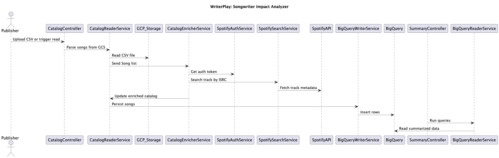

# WriterPlay: Songwriter Impact Analyzer

## Goal

**WriterPlay** is a backend analytics system designed for songwriters to measure the performance of their song catalog.  
It enriches song data using the **Spotify API** and generates insights using GCP services like **BigQuery** and **Cloud Storage**.

## Features



- Upload catalog CSVs (title, ISRC, writers) to Google Cloud Storage
- Enrich each song with Spotify metadata (track ID, popularity, artists)
- Store and query song data using BigQuery
- Analyze catalog trends via REST API endpoints:
    - `/catalog-summary`: Top writers, average popularity
    - `/songwriter-summary?name=XYZ`: Songwriter-specific stats

## How to run?

You will need to create a IAM service account and provide it 'Storage Object Viewer', 'BigQuery Data Editor' and 'BigQuery Job User' roles.
Then you will need a JSON key file for this IAM service account.

Before you start set this environmental variable:
```commandline
export GOOGLE_APPLICATION_CREDENTIALS="/path/to/your/key.json"
export SPOTIFY_CLIENT_ID="your-client-id"
export SPOTIFY_CLIENT_SECRET="your-client-secret"
```

You will also need to create a bucket called `writerplay-catalogs`. And upload `test_catalog.csv` file to it.

You will also need a BigQuery database `writerplay` with an `enriched_songs` table with the following schema:

| Field          | Type    | Mode     |
|----------------|---------|----------|
| title          | STRING  | REQUIRED |
| isrc           | STRING  | REQUIRED |
| writers        | STRING  | REPEATED |
| spotifyTrackId | STRING  | NULLABLE |
| popularity     | INTEGER | NULLABLE |
| artists        | STRING  | REPEATED |

To build and run:

```commandline
mvn spring-boot:run
```